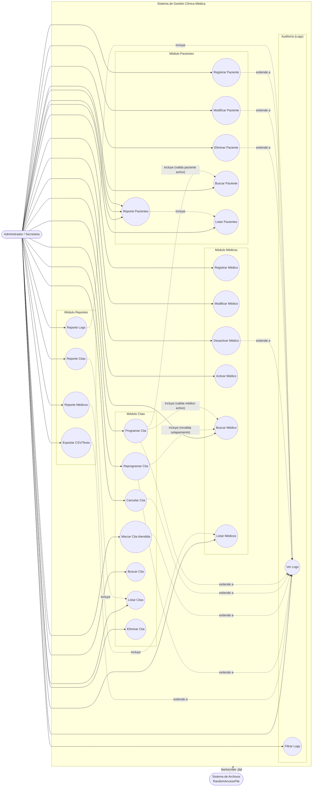

# Diagrama de Casos de Uso - Sistema de Gestión Clínica Médica

---

## Especificación de Casos de Uso (Alto Nivel)

> Las siguientes especificaciones detallan cada caso de uso con su flujo principal y alternativos. Su objetivo es servir de guía para la **defensa del proyecto**: deben poder explicarse con base en el código real (controladores, gestores `RandomAccessFile` y GUI).

---

### 3.1 CU-01: Registrar Paciente

| Campo | Detalle |
|-------|---------|
| **Identificador** | CU-01 |
| **Nombre** | Registrar Paciente |
| **Actor Primario** | Administrador / Secretaria |
| **Actores Secundarios** | Sistema de Archivos (RandomAccessFile) |
| **Descripción** | Permite dar de alta a un nuevo paciente en la clínica, validando su identificación única (CUI) y datos obligatorios, y persistiéndolo en `pacientes.dat`. |
| **Precondiciones** | 1. El usuario tiene acceso al módulo de Pacientes. 2. El archivo `pacientes.dat` está abierto en modo lectura/escritura. |
| **Postcondiciones — Éxito** | 1. Se crea un nuevo registro de paciente (activo) en `pacientes.dat`. 2. El paciente puede ser buscado por CUI, nombre o tipo de sangre. |
| **Postcondiciones — Fracaso** | El paciente no es registrado. El sistema muestra el mensaje de error correspondiente y el formulario permanece activo para corrección. |
| **Flujo Principal — Pasos** | 1. El usuario accede a Módulos > Pacientes. 2. Hace clic en "Nuevo". 3. Ingresa CUI, nombres y apellidos, fecha de nacimiento, sexo, teléfono, correo (opcional) y tipo de sangre. 4. Hace clic en "Guardar". 5. El sistema valida que el CUI tenga exactamente 13 dígitos y no esté ya registrado. 6. El sistema valida que nombres, fecha de nacimiento y sexo cumplan el formato obligatorio. 7. El controlador crea el objeto `Paciente` y lo persiste al final de `pacientes.dat`. 8. El sistema registra la operación en el log de auditoría (CREAR). 9. La tabla de pacientes se refresca mostrando el nuevo registro. |
| **Flujo Alternativo FA-01 — CUI duplicado (paso 5)** | 5a. El sistema detecta que ya existe un paciente con ese CUI. 5b. Muestra el mensaje: "Ya existe un paciente con CUI: X". 5c. El flujo regresa al paso 3 para corregir el dato. |
| **Flujo Alternativo FA-02 — CUI con formato inválido (paso 5)** | 5a. El CUI no coincide con el patrón `\d{13}`. 5b. Muestra: "CUI debe tener exactamente 13 dígitos numéricos". 5c. Regresa al paso 3. |
| **Flujo Alternativo FA-03 — Datos obligatorios vacíos (paso 6)** | 6a. Nombres, fecha o sexo son inválidos. 6b. Muestra el mensaje de validación correspondiente. 6c. Regresa al paso 3. |

---

### 3.2 CU-02: Modificar Paciente

| Campo | Detalle |
|-------|---------|
| **Identificador** | CU-02 |
| **Nombre** | Modificar Paciente |
| **Actor Primario** | Administrador |
| **Actores Secundarios** | Sistema de Archivos (RandomAccessFile) |
| **Descripción** | Permite actualizar los datos de un paciente existente. El CUI (clave primaria) no se puede modificar. |
| **Precondiciones** | 1. Existe un paciente activo registrado. 2. El usuario seleccionó un paciente en la tabla. |
| **Postcondiciones — Éxito** | El registro del paciente se sobrescribe en su misma posición dentro de `pacientes.dat`, con los nuevos datos. |
| **Postcondiciones — Fracaso** | No se modifica el registro. Se muestra el error y el formulario permanece activo. |
| **Flujo Principal — Pasos** | 1. El usuario selecciona un paciente en la tabla (modo edición). 2. El sistema carga los datos en el formulario y deshabilita el campo CUI. 3. El usuario edita nombres, fecha, sexo, teléfono, correo y tipo de sangre. 4. Hace clic en "Guardar". 5. El sistema valida que el paciente exista mediante `buscarPorCui`.  6. Valida los datos obligatorios. 7. Crea el objeto `Paciente` actualizado (conservando el mismo CUI) y lo persiste con `actualizar()`. 8. El registro se sobrescribe en su posición con `RandomAccessFile.seek(pos)`.  9. Se registra el log (ACTUALIZAR). 10. La tabla se refresca. |
| **Flujo Alternativo FA-01 — Paciente no encontrado (paso 5)** | 5a. `buscarPorCui` retorna `null`. 5b. Muestra: "Paciente no encontrado con CUI: X". 5c. Regresa al estado inicial. |
| **Flujo Alternativo FA-02 — Datos inválidos (paso 6)** | 6a. Nombres, fecha o sexo inválidos. 6b. Muestra el mensaje de validación. 6c. Regresa al paso 3. |

---

### 3.3 CU-03: Eliminar Paciente (Lógico) y Reactivar

| Campo | Detalle |
|-------|---------|
| **Identificador** | CU-03 |
| **Nombre** | Eliminar / Reactivar Paciente |
| **Actor Primario** | Administrador |
| **Actores Secundarios** | Sistema de Archivos (RandomAccessFile) |
| **Descripción** | Permite eliminar lógicamente un paciente (marcándolo como inactivo) o reactivarlo. El registro físico se conserva en el archivo. |
| **Precondiciones** | 1. Existe un paciente activo (para eliminar) o inactivo (para reactivar). |
| **Postcondiciones — Éxito** | La bandera `activo` del registro cambia (0 al eliminar, 1 al reactivar) sin borrar la posición física. |
| **Postcondiciones — Fracaso** | No se produce el cambio de estado; se muestra el error. |
| **Flujo Principal — Pasos (Eliminar)** | 1. El usuario selecciona un paciente activo. 2. Hace clic en "Eliminar (Lógico)". 3. El sistema pide confirmación. 4. Si confirma, el controlador llama a `eliminarPaciente(cui)`. 5. El gestor recorre los registros, ubica el CUI y escribe `activo='0'` en su posición. 6. Se registra el log (ELIMINAR). 7. La tabla se refresca. |
| **Flujo Principal — Pasos (Reactivar)** | 1. El usuario ubica al paciente inactivo. 2. Activa la reactivación. 3. El gestor escribe `activo='1'` y registra el log (ACTIVAR). |
| **Flujo Alternativo FA-01 — Eliminar un paciente inexistente** | El sistema muestra "Paciente no encontrado con CUI: X". |
| **Flujo Alternativo FA-02 — Usuario cancela la confirmación (paso 3)** | No se realiza ninguna modificación. |

> **Nota**: la eliminación es **lógica** (bandera `activo`). Aunque existe `eliminarFisico()` (que compacta el archivo), la GUI no lo utiliza.

---

### 3.4 CU-04: Registrar Médico

| Campo | Detalle |
|-------|---------|
| **Identificador** | CU-04 |
| **Nombre** | Registrar Médico |
| **Actor Primario** | Administrador |
| **Actores Secundarios** | Sistema de Archivos (RandomAccessFile) |
| **Descripción** | Permite registrar a un profesional de la salud. El sistema genera automáticamente su identificador único (UUID). |
| **Precondiciones** | 1. Acceso al módulo de Médicos. 2. `medicos.dat` abierto en modo `rw`. |
| **Postcondiciones — Éxito** | Se crea un nuevo registro de médico (activo, con UUID) en `medicos.dat`. |
| **Postcondiciones — Fracaso** | No se registra; se muestra el error y el formulario permanece activo. |
| **Flujo Principal — Pasos** | 1. El usuario accede a Módulos > Médicos. 2. Hace clic en "Nuevo". 3. Ingresa nombres, especialidad, teléfono, correo, horario inicio y horario fin. 4. Hace clic en "Guardar". 5. El sistema valida que nombres y especialidad sean obligatorios. 6. Valida el formato de horario `HH:MM` en los setters. 7. El constructor genera `UUID.randomUUID()`. 8. El controlador persiste al final de `medicos.dat`. 9. Se registra el log (CREAR). 10. Se refresca la tabla y el combo de especialidades. |
| **Flujo Alternativo FA-01 — Obligatorios vacíos (paso 5)** | Muestra "Nombres y apellidos son obligatorios" o "Especialidad es obligatoria". |
| **Flujo Alternativo FA-02 — Horario inválido (paso 6)** | Muestra "Formato de hora inválido. Use HH:MM". |

---

### 3.5 CU-05: Modificar / Activar / Desactivar Médico

| Campo | Detalle |
|-------|---------|
| **Identificador** | CU-05 |
| **Nombre** | Modificar, Activar o Desactivar Médico |
| **Actor Primario** | Administrador |
| **Actores Secundarios** | Sistema de Archivos (RandomAccessFile) |
| **Descripción** | Permite actualizar los datos de un médico y cambiar su estado entre activo e inactivo. El cambio de horario se registra en el log para trazabilidad. |
| **Precondiciones** | 1. Existe un médico registrado. |
| **Postcondiciones — Éxito** | El registro del médico se sobrescribe (modificación) o cambia su bandera `activo` (activar/desactivar) en `medicos.dat`. |
| **Postcondiciones — Fracaso** | No se modifica; se muestra el error. |
| **Flujo Principal — Pasos (Modificar)** | 1. El usuario selecciona un médico. 2. Edita campos y hace clic en "Guardar". 3. El controlador llama a `actualizarMedico(...)`. 4. Detecta si hubo cambio de horario y lo agrega al detalle del log. 5. Sobrescribe el registro en su posición y registra el log (ACTUALIZAR). |
| **Flujo Principal — Pasos (Activar/Desactivar)** | 1. El usuario selecciona el médico y hace clic en "Activar" o "Desactivar". 2. Confirma la operación. 3. `cambiarEstado(id, bool)` escribe la nueva bandera en su posición. 4. Se registra el log (ACTIVAR / DESACTIVAR). |
| **Flujo Alternativo FA-01 — Médico no encontrado (paso 3)** | Muestra "Médico no encontrado con ID: X". |
| **Flujo Alternativo FA-02 — Cambio de horario con citas programadas** | El sistema **no** valida las citas existentes actualmente (queda como trabajo futuro); únicamente registra el cambio en el log. |

---

### 3.6 CU-06: Programar Cita (Caso de Uso Central)

| Campo | Detalle |
|-------|---------|
| **Identificador** | CU-06 |
| **Nombre** | Programar Cita |
| **Actor Primario** | Administrador / Secretaria |
| **Actores Secundarios** | Sistema de Archivos (RandomAccessFile) |
| **Descripción** | Permite agendar una cita médica asociando un paciente activo con un médico activo, validando que no exista solapamiento horario. |
| **Precondiciones** | 1. Existe un paciente activo. 2. Existe un médico activo. 3. El archivo `citas.dat` está abierto en `rw`. |
| **Postcondiciones — Éxito** | 1. Se crea una cita con estado **Programada** y UUID generado. 2. Se persiste al final de `citas.dat`. 3. Se registra el log (CREAR). |
| **Postcondiciones — Fracaso** | La cita no se programa; se muestra el error correspondiente. |
| **Flujo Principal — Pasos** | 1. El usuario accede a Módulos > Citas y hace clic en "Nueva Cita". 2. Ingresa CUI del paciente, selecciona médico, fecha, hora, motivo y observaciones. 3. Hace clic en "Guardar". 4. El sistema valida que el paciente exista y esté activo (`validarPacienteActivo`). 5. Valida que el médico exista y esté activo (`validarMedicoActivo`). 6. Valida el **anti-solapamiento**: no debe existir otra cita activa del mismo médico en la misma fecha con horarios que se superpongan (duración fija de 30 minutos). 7. Genera el UUID de la cita y persiste al final del archivo (`seek(length())`). 8. Se registra el log (CREAR). 9. Se muestra "Cita programada correctamente". |
| **Flujo Alternativo FA-01 — Paciente no existe (paso 4)** | 4a. Muestra "Paciente no existe con CUI: X". 4b. Regresa el control al formulario. |
| **Flujo Alternativo FA-02 — Paciente inactivo (paso 4)** | Muestra "Paciente inactivo/eliminado con CUI: X". |
| **Flujo Alternativo FA-03 — Médico no existe (paso 5)** | Muestra "Médico no existe con ID: X". |
| **Flujo Alternativo FA-04 — Médico inactivo (paso 5)** | Muestra "Médico inactivo con ID: X". |
| **Flujo Alternativo FA-05 — Solapamiento (paso 6)** | 6a. `existeSolapamiento` retorna `true`. 6b. Muestra: "El médico ya tiene una cita programada a esa hora en esa fecha (solapamiento de 30 min)". |

> **Nota de defensa (anti-solapamiento)**: `seSolapan(h1, h2)` convierte `HH:MM` a minutos desde medianoche, calcula `fin = inicio + 30` y verifica `inicio1 < fin2 && inicio2 < fin1`. Este algoritmo también se usa en `existeSolapamiento` con el parámetro `excluirIdCita` para no autodetectarse.

---

### 3.7 CU-07: Buscar y Listar Citas

| Campo | Detalle |
|-------|---------|
| **Identificador** | CU-07 |
| **Nombre** | Buscar y Listar Citas |
| **Actor Primario** | Administrador |
| **Actores Secundarios** | Sistema de Archivos (RandomAccessFile) |
| **Descripción** | Permite consultar las citas del sistema mediante filtros: por paciente, médico, estado, fecha o rango de fechas. |
| **Precondiciones** | 1. `citas.dat` abierto en `rw`. |
| **Postcondiciones — Éxito** | El sistema muestra en la tabla las citas que coinciden con el filtro aplicado. |
| **Postcondiciones — Fracaso** | El error de búsqueda se muestra y no se actualiza la tabla. |
| **Flujo Principal — Pasos** | 1. El usuario accede a Módulos > Citas. 2. Opcionalmente ingresa filtros (CUI paciente, médico, estado, fechas). 3. Hace clic en "Filtrar" o "Limpiar". 4. El controlador delega la búsqueda al gestor correspondiente (`buscarPorPaciente`, `buscarPorMedico`, `buscarPorEstado`, `buscarPorRangoFechas`). 5. El gestor recorre secuencialmente los registros activos filtrando por el criterio. 6. Se registra el log (BUSCAR). 7. Se muestra la tabla de resultados (con nombre del médico resuelto). |
| **Flujo Alternativo FA-01 — Búsqueda por paciente inexistente** | El controlador valida la existencia del paciente y muestra el error si no existe. |
| **Flujo Alternativo FA-02 — Sin resultados** | La tabla se muestra vacía (sin error). |
| **Flujo Alternativo FA-03 — Búsqueda por rango** | `buscarPorRangoFechas` compara cada fecha contra el rango usando `compararFechas` (DD/MM/YYYY). |

---

### 3.8 CU-08: Cancelar Cita

| Campo | Detalle |
|-------|---------|
| **Identificador** | CU-08 |
| **Nombre** | Cancelar Cita |
| **Actor Primario** | Administrador |
| **Actores Secundarios** | Sistema de Archivos (RandomAccessFile) |
| **Descripción** | Cambia el estado de una cita a **Cancelada**, sobrescribiendo el registro en su posición. |
| **Precondiciones** | 1. Existe una cita activa seleccionada. |
| **Postcondiciones — Éxito** | El estado de la cita cambia a **Cancelada** en `citas.dat` y se registra el log (CANCELAR). |
| **Postcondiciones — Fracaso** | No cambia el estado; se muestra el error. |
| **Flujo Principal — Pasos** | 1. El usuario selecciona una cita y hace clic en "Cancelar Cita". 2. El controlador llama a `cancelarCita(idCita)`. 3. Verifica que la cita exista (`buscarPorId`). 4. `gestorCita.cancelar(id)` recorre, ubica el registro y escribe `EST_CANCELADA`. 5. Se registra el log (CANCELAR). 6. Se refresca la tabla. |
| **Flujo Alternativo FA-01 — Cita no encontrada (paso 3)** | Muestra "Cita no encontrada con ID: X". |

---

### 3.9 CU-09: Marcar Cita Atendida

| Campo | Detalle |
|-------|---------|
| **Identificador** | CU-09 |
| **Nombre** | Marcar Cita Atendida |
| **Actor Primario** | Administrador |
| **Actores Secundarios** | Sistema de Archivos (RandomAccessFile) |
| **Descripción** | Cambia el estado de la cita a **Atendida**. |
| **Precondiciones** | 1. Existe una cita activa. |
| **Postcondiciones — Éxito** | El estado cambia a **Atendida** en `citas.dat` y se registra el log (ATENDER). |
| **Postcondiciones — Fracaso** | No cambia; se muestra el error. |
| **Flujo Principal — Pasos** | 1. El usuario selecciona una cita y hace clic en "Marcar Atendida". 2. `marcarAtendida(id)` ubica el registro y escribe `EST_ATENDIDA`. 3. Se registra el log (ATENDER). |
| **Flujo Alternativo FA-01 — Cita no encontrada** | Muestra "Cita no encontrada con ID: X". |

---

### 3.10 CU-10: Reprogramar Cita

| Campo | Detalle |
|-------|---------|
| **Identificador** | CU-10 |
| **Nombre** | Reprogramar Cita |
| **Actor Primario** | Administrador |
| **Actores Secundarios** | Sistema de Archivos (RandomAccessFile) |
| **Descripción** | Permite cambiar fecha, hora o médico de una cita, revalidando el anti-solapamiento excluyendo la propia cita. El estado vuelve a **Programada**. |
| **Precondiciones** | 1. Existe una cita activa. 2. Si se cambia de médico, el nuevo debe estar activo. |
| **Postcondiciones — Éxito** | La cita queda reprogramada con estado **Programada**, sobrescrita en su posición y con log (REPROGRAMAR). |
| **Postcondiciones — Fracaso** | No se modifica la cita; se muestra el error. |
| **Flujo Principal — Pasos** | 1. El usuario selecciona una cita y hace clic en "Reprogramar". 2. Edita fecha, hora y/o médico. 3. `reprogramarCita(id, fecha, hora, idMedFinal, motivo, obs)`. 4. Verifica que la cita exista. 5. Si cambia de médico, valida que el nuevo esté activo. 6. Valida solapamiento con `existeSolapamiento(..., idCita)` excluyendo la cita actual. 7. Actualiza los campos y establece el estado **Programada**. 8. Sobrescribe el registro y registra el log (REPROGRAMAR). |
| **Flujo Alternativo FA-01 — Cita no encontrada (paso 4)** | Muestra "Cita no encontrada con ID: X". |
| **Flujo Alternativo FA-02 — Nuevo médico inactivo (paso 5)** | Muestra "Médico inactivo con ID: X". |
| **Flujo Alternativo FA-03 — Solapamiento con otra cita (paso 6)** | Muestra "Solapamiento con otra cita del médico en esa fecha/hora". |

---

### 3.11 CU-11: Actualizar Detalles de Cita y Eliminar Cita

| Campo | Detalle |
|-------|---------|
| **Identificador** | CU-11 |
| **Nombre** | Actualizar Detalles / Eliminar Cita |
| **Actor Primario** | Administrador |
| **Actores Secundarios** | Sistema de Archivos (RandomAccessFile) |
| **Descripción** | Permite editar el motivo u observaciones de una cita (sin cambiar fecha/hora/médico) y eliminar lógicamente una cita. |
| **Precondiciones** | 1. Existe una cita activa seleccionada. |
| **Postcondiciones — Éxito** | 1. (Actualizar) El motivo/observaciones cambian y se registra el log (ACTUALIZAR). 2. (Eliminar) La bandera `activa` del registro pasa a `false` y se registra el log (ELIMINAR). |
| **Postcondiciones — Fracaso** | No se modifica; se muestra el error. |
| **Flujo Principal — Pasos (Actualizar)** | 1. El usuario selecciona la cita y edita motivo/observaciones. 2. "Guardar Cambios" llama a `actualizarDetalles(id, motivo, obs)`. 3. Se sobrescribe el registro y se registra el log. |
| **Flujo Principal — Pasos (Eliminar)** | 1. "Eliminar (Lógico)" pide confirmación. 2. `eliminarCita(id)` marca `activa=false` y registra el log (ELIMINAR). |
| **Flujo Alternativo FA-01 — Cita no encontrada** | Muestra "Cita no encontrada con ID: X". |
| **Flujo Alternativo FA-02 — Usuario cancela la eliminación** | No se realiza ninguna operación. |

---

### 3.12 CU-12: Generar Reportes de Pacientes

| Campo | Detalle |
|-------|---------|
| **Identificador** | CU-12 |
| **Nombre** | Generar Reporte de Pacientes |
| **Actor Primario** | Administrador |
| **Actores Secundarios** | Sistema de Archivos (RandomAccessFile) |
| **Descripción** | Presenta información de pacientes según diferentes criterios: completo, por tipo de sangre, con más citas y sin citas. |
| **Precondiciones** | 1. `pacientes.dat` y `citas.dat` abiertos en `rw`. |
| **Postcondiciones — Éxito** | El sistema muestra la tabla con los datos solicitados y registra el log (GENERAR). |
| **Postcondiciones — Fracaso** | Se muestra el error y no se actualiza la tabla. |
| **Flujo Principal — Pasos** | 1. El usuario accede a Reportes > Generar Reportes. 2. (Opcional) Aplica el filtro de tipo de sangre. 3. En la pestaña Pacientes, el sistema carga `reporteCompletoPacientes()` o `reportePorTipoSangre(sangre)`. 4. En la pestaña Reportes Especiales, genera `reportePacientesConMasCitas()` y `reportePacientesSinCitas()`. 5. Los agregados se calculan con streams (`groupingBy`, `counting`, orden descendente). 6. Se registra el log correspondiente. 7. Se muestra la tabla. |
| **Flujo Alternativo FA-01 — Sin datos** | La tabla se muestra vacía. |

---

### 3.13 CU-13: Generar Reportes de Médicos

| Campo | Detalle |
|-------|---------|
| **Identificador** | CU-13 |
| **Nombre** | Generar Reporte de Médicos |
| **Actor Primario** | Administrador |
| **Actores Secundarios** | Sistema de Archivos (RandomAccessFile) |
| **Descripción** | Presenta información de médicos: completo, por especialidad, con más citas y con citas en una fecha específica. |
| **Precondiciones** | 1. `medicos.dat` y `citas.dat` abiertos. |
| **Postcondiciones — Éxito** | Se muestra la tabla con el reporte solicitado y se registra el log. |
| **Flujo Principal — Pasos** | 1. El usuario accede a Reportes. 2. En la pestaña Médicos, aplica el filtro de especialidad o carga el reporte completo. 3. El controlador consulta los gestores y agrega con streams. 4. Se registra el log y se muestra la tabla. |

---

### 3.14 CU-14: Generar Reportes de Citas

| Campo | Detalle |
|-------|---------|
| **Identificador** | CU-14 |
| **Nombre** | Generar Reporte de Citas |
| **Actor Primario** | Administrador |
| **Actores Secundarios** | Sistema de Archivos (RandomAccessFile) |
| **Descripción** | Presenta las citas por distintos criterios: completo, por rango de fechas, por estado, por especialidad, por paciente o por médico. |
| **Precondiciones** | 1. `citas.dat` abierto. |
| **Postcondiciones — Éxito** | Se muestra el reporte (tabla) y se registra el log. |
| **Postcondiciones — Fracaso** | Se muestra el error correspondiente. |
| **Flujo Principal — Pasos** | 1. El usuario va a Reportes > pestaña Citas. 2. Aplica filtro de estado o rango de fechas, o deja el reporte completo. 3. El controlador recupera las citas según el criterio. 4. Genera también `reporteCitasPorEspecialidad()` (cantidad por especialidad). 5. Se registra el log y se muestra la tabla. |

---

### 3.15 CU-15: Exportar a CSV / Texto

| Campo | Detalle |
|-------|---------|
| **Identificador** | CU-15 |
| **Nombre** | Exportar a CSV / Texto |
| **Actor Primario** | Administrador |
| **Actores Secundarios** | Sistema de Archivos del SO (archivo de salida) |
| **Descripción** | Genera un archivo externo (`.csv` o `.txt`) con los datos de un reporte de pacientes, médicos, citas o logs. |
| **Precondiciones** | 1. Existe un reporte cargado en el diálogo. 2. El usuario tiene permisos de escritura en la ruta. |
| **Postcondiciones — Éxito** | 1. Se crea el archivo de salida con cabecera y filas. 2. Se registra el log (EXPORTAR_CSV / EXPORTAR_TXT). |
| **Postcondiciones — Fracaso** | No se crea el archivo; se muestra el error. |
| **Flujo Principal — Pasos** | 1. El usuario hace clic en "Exportar ... CSV" o "... TXT". 2. El `JFileChooser` permite elegir la ruta. 3. El controlador escribe la cabecera y cada fila (con `escapeCsv` para manejar comas/comillas). 4. Para TXT usa `exportarTextoPlano` con cabeceras y separador `-+-`. 5. Se registra el log y se confirma la ruta. |
| **Flujo Alternativo FA-01 — Ruta no válida / sin permisos** | Muestra "Error exportando: <mensaje>". |

---

### 3.16 CU-16: Ver y Filtrar Logs de Auditoría

| Campo | Detalle |
|-------|---------|
| **Identificador** | CU-16 |
| **Nombre** | Ver y Filtrar Logs |
| **Actor Primario** | Administrador |
| **Actores Secundarios** | Sistema de Archivos (RandomAccessFile) |
| **Descripción** | Muestra el historial de interacciones del sistema y permite filtrarlo por módulo, operación, entidad, ID, fecha o usuario. |
| **Precondiciones** | 1. `logs.dat` abierto en `rw`. |
| **Postcondiciones — Éxito** | El sistema muestra los logs (más recientes primero) según el filtro aplicado. |
| **Postcondiciones — Fracaso** | Muestra el error; la tabla queda sin cambios. |
| **Flujo Principal — Pasos** | 1. El usuario accede a Auditoría > Ver Logs. 2. `listarTodos()` lee `logs.dat` de forma **inversa** (de `total-1` a `0`). 3. Opcionalmente aplica filtros (módulo, operación, entidad, fecha, usuario). 4. Muestra la tabla con timestamp, módulo, operación, entidad, ID y usuario. 5. Puede exportar los logs a CSV/TXT. |
| **Flujo Alternativo FA-01 — Lectura inversa** | Se itera de atrás hacia adelante para listar primero los más recientes. |

---

### 3.17 CU-17: Iniciar Sesión (Login)

| Campo | Detalle |
|-------|---------|
| **Identificador** | CU-17 |
| **Nombre** | Iniciar Sesión |
| **Actor Primario** | Administrador |
| **Actores Secundarios** | Sistema de Archivos (RandomAccessFile) |
| **Descripción** | Al arrancar la aplicación, se registra el inicio de sesión del usuario actual en el log. |
| **Precondiciones** | 1. La aplicación arranca correctamente. 2. `logs.dat` se abre en `rw`. |
| **Postcondiciones — Éxito** | Se registra un log (LOGIN) con el usuario "admin". |
| **Flujo Principal — Pasos** | 1. La JVM ejecuta `main`. 2. `VentanaPrincipal` construye gestores y controladores. 3. Llama a `ctrlLogs.logLogin()`. 4. El gestor registra (Sistema, LOGIN, Usuario, "admin"). 5. La ventana se muestra. |

---

### 3.18 CU-18: Cerrar Sesión / Cerrar Aplicación (Logout)

| Campo | Detalle |
|-------|---------|
| **Identificador** | CU-18 |
| **Nombre** | Cerrar Sesión / Cerrar Aplicación |
| **Actor Primario** | Administrador |
| **Actores Secundarios** | Sistema de Archivos (RandomAccessFile) |
| **Descripción** | Al salir, el sistema registra el cierre de sesión y libera los recursos de todos los gestores antes de terminar. |
| **Precondiciones** | 1. La aplicación está ejecutándose. |
| **Postcondiciones — Éxito** | 1. Se registra el log (LOGOUT). 2. Los 4 gestores cierran sus archivos. 3. La aplicación termina (`System.exit(0)`). |
| **Postcondiciones — Fracaso** | El usuario cancela la salida y la aplicación continúa. |
| **Flujo Principal — Pasos** | 1. El usuario elige Archivo > Salir o cierra la ventana. 2. `cerrarAplicacion()` pide confirmación. 3. Si confirma, registra `logLogout()`.  4. Cierra cada gestor (`cerrar()`). 5. Ejecuta `dispose()` y `System.exit(0)`. |
| **Flujo Alternativo FA-01 — Usuario cancela (paso 2)** | La aplicación permanece abierta sin registrar nada. |

---

## Actores del Sistema

| Actor | Descripción | Sirve a |
|-------|-------------|---------|
| **Administrador/Secretaria** | Usuario operativo que gestiona pacientes, médicos y citas, genera reportes y consulta auditoría | Todos los módulos |
| **Sistema de Archivos (RandomAccessFile)** | Actor secundario: provee persistencia binaria en archivos `.dat` (pacientes, medicos, citas, logs) | Toda operación CRUD, búsqueda y reporte |

---

## Relaciones Clave (para la defensa)

- **«include» Programar Cita → Buscar Paciente / Buscar Médico**: programar una cita obligatoriamente valida la existencia y estado activo del paciente y médico (CU-06 depende de los datos de CU-01 y CU-04).
- **«include» Reportes → Listar datos**: cualquier reporte recupera datos de los gestores.
- **«extend» Operaciones → Ver Logs**: todas las operaciones de escritura (crear, modificar, eliminar, cancelar, atender, reprogramar, activar, desactivar, exportar, login/logout) extienden la generación de un log de auditoría, que luego puede consultarse en el módulo de Logs (CU-16).

## Archivos de Datos Persistidos

| Archivo | Registros | Responsable |
|---------|-----------|-------------|
| `pacientes.dat` | Paciente | GestorArchivoPaciente |
| `medicos.dat` | Medico | GestorArchivoMedico |
| `citas.dat` | Cita | GestorArchivoCita |
| `logs.dat` | LogEntry | GestorArchivoLog |
