# Diagramas de Secuencia - Sistema de Gestión Clínica Médica

Los diagramas de secuencia muestran los flujos de interacción entre los objetos del sistema, destacando las **validaciones de negocio**, la **persistencia con RandomAccessFile** y la **auditoría (logs)**.

---
## Diagrama 1: Programar una Cita (Flujo Principal del Caso de Uso "Gestionar Citas")

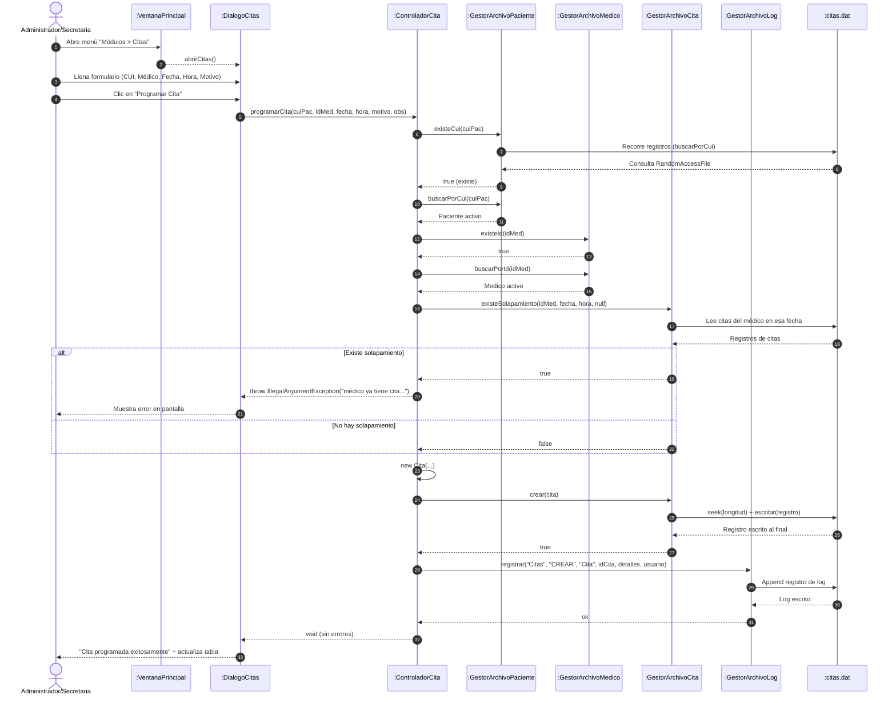
```mermaid
sequenceDiagram
    autonumber
    actor A as Administrador/Secretaria
    participant VP as :VentanaPrincipal
    participant DC as :DialogoCitas
    participant CC as :ControladorCita
    participant GP as :GestorArchivoPaciente
    participant GM as :GestorArchivoMedico
    participant GC as :GestorArchivoCita
    participant GL as :GestorArchivoLog
    participant F as :citas.dat

    A->>VP: Abre menú "Módulos > Citas"
    VP-->>DC: abrirCitas()
    A->>DC: Llena formulario (CUI, Médico, Fecha, Hora, Motivo)
    A->>DC: Clic en "Programar Cita"
    DC->>CC: programarCita(cuiPac, idMed, fecha, hora, motivo, obs)

    %% 1) Validar paciente activo
    CC->>GP: existeCui(cuiPac)
    GP->>F: Recorre registros (buscarPorCui)
    F-->>GP: Consulta RandomAccessFile
    GP-->>CC: true (existe)

    CC->>GP: buscarPorCui(cuiPac)
    GP-->>CC: Paciente activo

    %% 2) Validar médico activo
    CC->>GM: existeId(idMed)
    GM-->>CC: true
    CC->>GM: buscarPorId(idMed)
    GM-->>CC: Medico activo

    %% 3) Validar solapamiento
    CC->>GC: existeSolapamiento(idMed, fecha, hora, null)
    GC->>F: Lee citas del médico en esa fecha
    F-->>GC: Registros de citas
    alt Existe solapamiento
        GC-->>CC: true
        CC-->>DC: throw IllegalArgumentException("médico ya tiene cita...")
        DC-->>A: Muestra error en pantalla
    else No hay solapamiento
        GC-->>CC: false
    end

    %% 4) Crear entidad + persistir
    CC->>CC: new Cita(...)
    CC->>GC: crear(cita)
    GC->>F: seek(longitud) + escribir(registro)
    F-->>GC: Registro escrito al final
    GC-->>CC: true

    %% 5) Auditoría
    CC->>GL: registrar("Citas", "CREAR", "Cita", idCita, detalles, usuario)
    GL->>F: Append registro de log
    F-->>GL: Log escrito
    GL-->>CC: ok

    CC-->>DC: void (sin errores)
    DC-->>A: "Cita programada exitosamente" + actualiza tabla
```

---

## Diagrama 2: Registrar un Nuevo Paciente (Caso de Uso "Gestionar Pacientes")

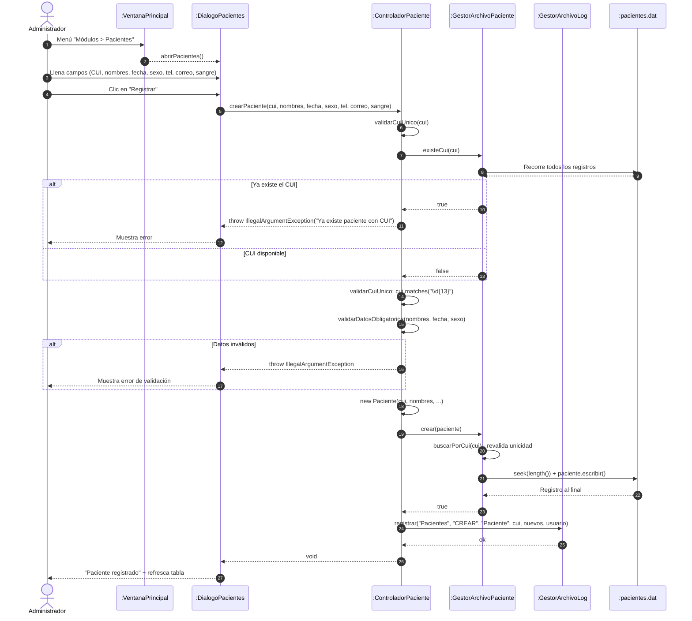
```mermaid
sequenceDiagram
    autonumber
    actor A as Administrador
    participant VP as :VentanaPrincipal
    participant DP as :DialogoPacientes
    participant CP as :ControladorPaciente
    participant GPa as :GestorArchivoPaciente
    participant GL as :GestorArchivoLog
    participant F as :pacientes.dat

    A->>VP: Menú "Módulos > Pacientes"
    VP-->>DP: abrirPacientes()
    A->>DP: Llena campos (CUI, nombres, fecha, sexo, tel, correo, sangre)
    A->>DP: Clic en "Registrar"
    DP->>CP: crearPaciente(cui, nombres, fecha, sexo, tel, correo, sangre)

    %% Validación de unicidad de CUI (clave primaria)
    CP->>CP: validarCuiUnico(cui)
    CP->>GPa: existeCui(cui)
    GPa->>F: Recorre todos los registros
    F-->>GPa: 
    alt Ya existe el CUI
        GPa-->>CP: true
        CP-->>DP: throw IllegalArgumentException("Ya existe paciente con CUI")
        DP-->>A: Muestra error
    else CUI disponible
        GPa-->>CP: false
    end

    %% Validación formato CUI (13 dígitos)
    CP->>CP: validarCuiUnico: cui.matches("\\d{13}")

    %% Validación datos obligatorios
    CP->>CP: validarDatosObligatorios(nombres, fecha, sexo)
    alt Datos inválidos
        CP-->>DP: throw IllegalArgumentException
        DP-->>A: Muestra error de validación
    end

    %% Crear entidad
    CP->>CP: new Paciente(cui, nombres, ...)
    
    %% Persistir
    CP->>GPa: crear(paciente)
    GPa->>GPa: buscarPorCui(cui) - revalida unicidad
    GPa->>F: seek(length()) + paciente.escribir()
    F-->>GPa: Registro al final
    GPa-->>CP: true

    %% Auditoría
    CP->>GL: registrar("Pacientes", "CREAR", "Paciente", cui, nuevos, usuario)
    GL-->>CP: ok

    CP-->>DP: void
    DP-->>A: "Paciente registrado" + refresca tabla
```

---

## Diagrama 3: Buscar Citas por Rango de Fechas (Reporte)

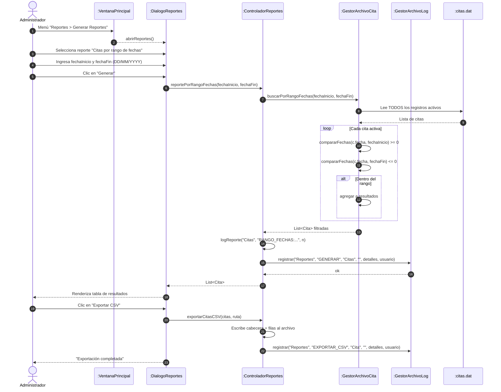
```mermaid
sequenceDiagram
    autonumber
    actor A as Administrador
    participant VP as :VentanaPrincipal
    participant DR as :DialogoReportes
    participant CR as :ControladorReportes
    participant GC as :GestorArchivoCita
    participant GL as :GestorArchivoLog
    participant F as :citas.dat

    A->>VP: Menú "Reportes > Generar Reportes"
    VP-->>DR: abrirReportes()
    A->>DR: Selecciona reporte "Citas por rango de fechas"
    A->>DR: Ingresa fechaInicio y fechaFin (DD/MM/YYYY)
    A->>DR: Clic en "Generar"
    DR->>CR: reportePorRangoFechas(fechaInicio, fechaFin)

    %% Consulta al gestor
    CR->>GC: buscarPorRangoFechas(fechaInicio, fechaFin)
    GC->>F: Lee TODOS los registros activos
    F-->>GC: Lista de citas

    loop Cada cita activa
        GC->>GC: compararFechas(c.fecha, fechaInicio) >= 0
        GC->>GC: compararFechas(c.fecha, fechaFin) <= 0
        alt Dentro del rango
            GC->>GC: agregar a resultados
        end
    end
    GC-->>CR: List<Cita> filtradas

    %% Auditoría del reporte
    CR->>CR: logReporte("Citas", "RANGO_FECHAS:...", n)
    CR->>GL: registrar("Reportes", "GENERAR", "Citas", "", detalles, usuario)
    GL-->>CR: ok

    CR-->>DR: List<Cita>
    DR-->>A: Renderiza tabla de resultados

    %% Exportación opcional
    A->>DR: Clic en "Exportar CSV"
    DR->>CR: exportarCitasCSV(citas, ruta)
    CR->>CR: Escribe cabecera + filas al archivo
    CR->>GL: registrar("Reportes", "EXPORTAR_CSV", "Cita", "", detalles, usuario)
    DR-->>A: "Exportación completada"
```

---

## Diagrama 4: Cancelar una Cita (Cambio de Estado)

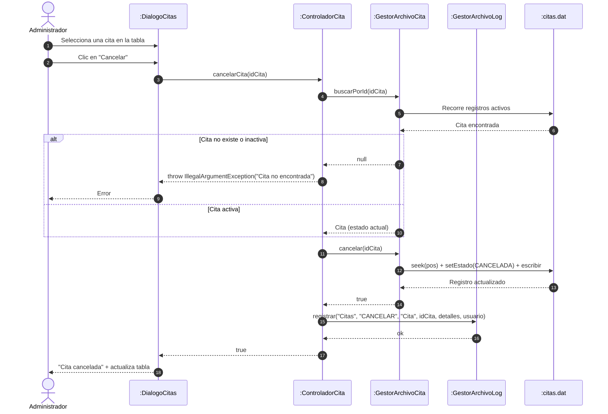
```mermaid
sequenceDiagram
    autonumber
    actor A as Administrador
    participant DC as :DialogoCitas
    participant CC as :ControladorCita
    participant GC as :GestorArchivoCita
    participant GL as :GestorArchivoLog
    participant F as :citas.dat

    A->>DC: Selecciona una cita en la tabla
    A->>DC: Clic en "Cancelar"
    DC->>CC: cancelarCita(idCita)

    %% Verificar existencia y estado
    CC->>GC: buscarPorId(idCita)
    GC->>F: Recorre registros activos
    F-->>GC: Cita encontrada
    alt Cita no existe o inactiva
        GC-->>CC: null
        CC-->>DC: throw IllegalArgumentException("Cita no encontrada")
        DC-->>A: Error
    else Cita activa
        GC-->>CC: Cita (estado actual)
    end

    %% Cambiar estado a CANCELADA
    CC->>GC: cancelar(idCita)
    GC->>F: seek(pos) + setEstado(CANCELADA) + escribir
    F-->>GC: Registro actualizado
    GC-->>CC: true

    %% Auditoría
    CC->>GL: registrar("Citas", "CANCELAR", "Cita", idCita, detalles, usuario)
    GL-->>CC: ok

    CC-->>DC: true
    DC-->>A: "Cita cancelada" + actualiza tabla
```

---

## Diagrama 5: Ver/Filtrar Logs de Auditoría

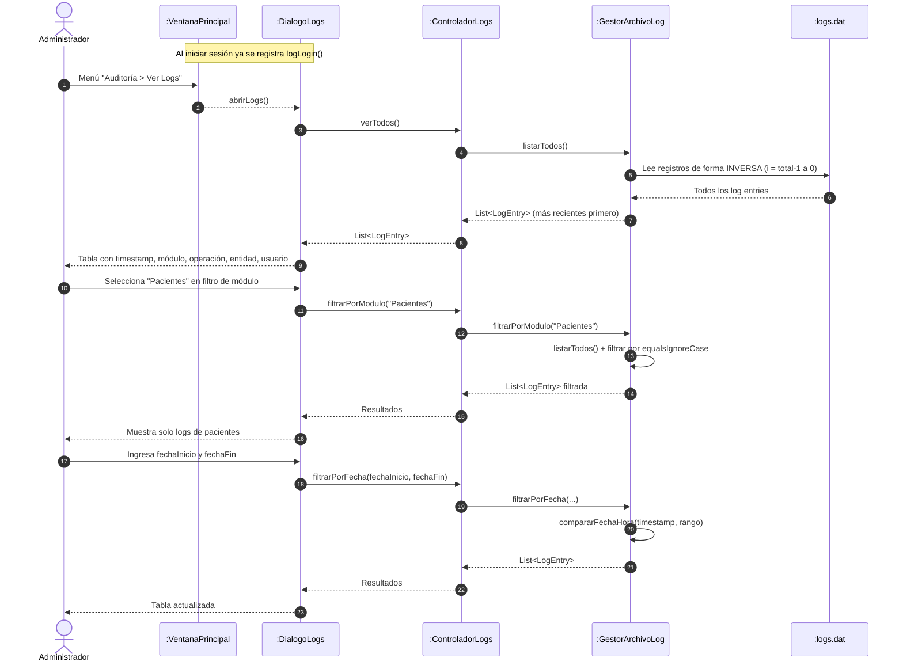
```mermaid
sequenceDiagram
    autonumber
    actor A as Administrador
    participant VP as :VentanaPrincipal
    participant DL as :DialogoLogs
    participant CL as :ControladorLogs
    participant GL as :GestorArchivoLog
    participant F as :logs.dat

    Note over VP,DL: Al iniciar sesión ya se registra logLogin()

    A->>VP: Menú "Auditoría > Ver Logs"
    VP-->>DL: abrirLogs()
    DL->>CL: verTodos()
    CL->>GL: listarTodos()
    GL->>F: Lee registros de forma INVERSA (i = total-1 a 0)
    F-->>GL: Todos los log entries
    GL-->>CL: List<LogEntry> (más recientes primero)
    CL-->>DL: List<LogEntry>
    DL-->>A: Tabla con timestamp, módulo, operación, entidad, usuario

    %% Filtrado por módulo
    A->>DL: Selecciona "Pacientes" en filtro de módulo
    DL->>CL: filtrarPorModulo("Pacientes")
    CL->>GL: filtrarPorModulo("Pacientes")
    GL->>GL: listarTodos() + filtrar por equalsIgnoreCase
    GL-->>CL: List<LogEntry> filtrada
    CL-->>DL: Resultados
    DL-->>A: Muestra solo logs de pacientes

    %% Filtrado por rango de fechas
    A->>DL: Ingresa fechaInicio y fechaFin
    DL->>CL: filtrarPorFecha(fechaInicio, fechaFin)
    CL->>GL: filtrarPorFecha(...)
    GL->>GL: compararFechaHora(timestamp, rango)
    GL-->>CL: List<LogEntry>
    CL-->>DL: Resultados
    DL-->>A: Tabla actualizada
```

---

## Diagrama 6: Inicialización de la Aplicación (Main + Inyección de Dependencias)

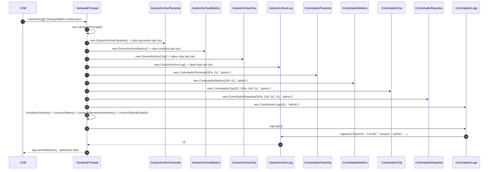
```mermaid
sequenceDiagram
    autonumber
    participant VM as :JVM
    participant VP as :VentanaPrincipal
    participant GPa as :GestorArchivoPaciente
    participant GM as :GestorArchivoMedico
    participant GC as :GestorArchivoCita
    participant GL as :GestorArchivoLog
    participant CP as :ControladorPaciente
    participant CM as :ControladorMedico
    participant CC as :ControladorCita
    participant CR as :ControladorReportes
    participant CL as :ControladorLogs

    VM->>VP: main(String[]) (SwingUtilities.invokeLater)
    VP->>VP: new VentanaPrincipal()
    VP->>GPa: new GestorArchivoPaciente() -> abre pacientes.dat (rw)
    VP->>GM: new GestorArchivoMedico() -> abre medicos.dat (rw)
    VP->>GC: new GestorArchivoCita() -> abre citas.dat (rw)
    VP->>GL: new GestorArchivoLog() -> abre logs.dat (rw)

    VP->>CP: new ControladorPaciente(GPa, GL, "admin")
    VP->>CM: new ControladorMedico(GM, GL, "admin")
    VP->>CC: new ControladorCita(GC, GPa, GM, GL, "admin")
    VP->>CR: new ControladorReportes(GPa, GM, GC, GL, "admin")
    VP->>CL: new ControladorLogs(GL, "admin")

    VP->>VP: inicializarVentana() + construirMenu() + construirBarraHerramientas() + construirBarraEstado()
    VP->>CL: logLogin()
    CL->>GL: registrar("Sistema", "LOGIN", "Usuario", "admin", ...)
    GL-->>VP: ok
    VP-->>VM: app.setVisible(true) - aplicación lista
```

---

## Diagrama 7: Reprogramar una Cita (Flujo que Revalida Solapamiento)

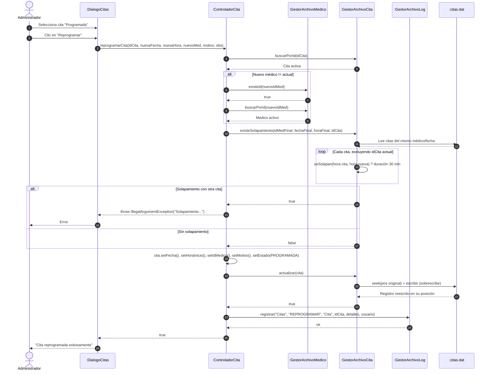
```mermaid
sequenceDiagram
    autonumber
    actor A as Administrador
    participant DC as :DialogoCitas
    participant CC as :ControladorCita
    participant GM as :GestorArchivoMedico
    participant GC as :GestorArchivoCita
    participant GL as :GestorArchivoLog
    participant F as :citas.dat

    A->>DC: Selecciona cita "Programada"
    A->>DC: Clic en "Reprogramar"
    DC->>CC: reprogramarCita(idCita, nuevaFecha, nuevaHora, nuevoMed, motivo, obs)

    %% 1) Verificar cita existe
    CC->>GC: buscarPorId(idCita)
    GC-->>CC: Cita activa

    %% 2) Si cambia de médico, validar nuevo médico activo
    alt Nuevo médico != actual
        CC->>GM: existeId(nuevoIdMed)
        GM-->>CC: true
        CC->>GM: buscarPorId(nuevoIdMed)
        GM-->>CC: Medico activo
    end

    %% 3) Validar solapamiento EXCLUYENDO la cita actual
    CC->>GC: existeSolapamiento(idMedFinal, fechaFinal, horaFinal, idCita)
    GC->>F: Lee citas del mismo médico/fecha
    F-->>GC: 
    loop Cada cita, excluyendo idCita actual
        GC->>GC: seSolapan(hora cita, hora nueva) ? duración 30 min
    end
    alt Solapamiento con otra cita
        GC-->>CC: true
        CC-->>DC: throw IllegalArgumentException("Solapamiento...")
        DC-->>A: Error
    else Sin solapamiento
        GC-->>CC: false
    end

    %% 4) Actualizar campos + estado a PROGRAMADA
    CC->>CC: cita.setFecha(), setHoraInicio(), setIdMedico(), setMotivo(), setEstado(PROGRAMADA)

    %% 5) Persistir
    CC->>GC: actualizar(cita)
    GC->>F: seek(pos original) + escribir (sobrescribe)
    F-->>GC: Registro reescrito en su posición
    GC-->>CC: true

    %% 6) Auditoría
    CC->>GL: registrar("Citas", "REPROGRAMAR", "Cita", idCita, detalles, usuario)
    GL-->>CC: ok
    CC-->>DC: true
    DC-->>A: "Cita reprogramada exitosamente"
```

---

## Diagrama 8: Modificar los Datos de un Paciente (Caso de Uso "Gestionar Pacientes")

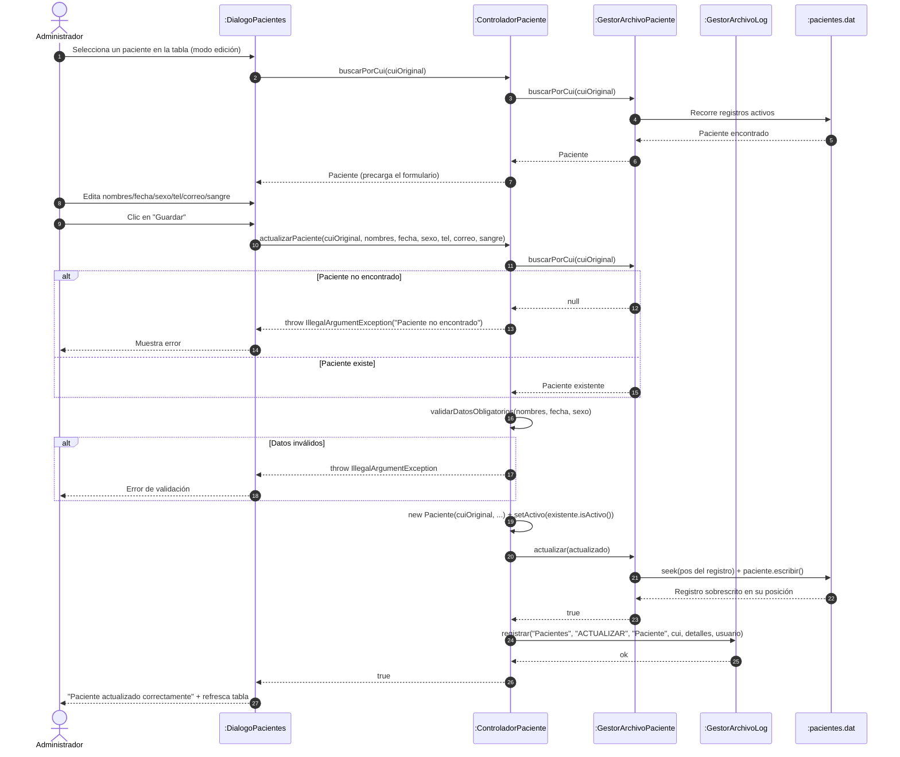
```mermaid
sequenceDiagram
    autonumber
    actor A as Administrador
    participant DP as :DialogoPacientes
    participant CP as :ControladorPaciente
    participant GPa as :GestorArchivoPaciente
    participant GL as :GestorArchivoLog
    participant F as :pacientes.dat

    A->>DP: Selecciona un paciente en la tabla (modo edición)
    DP->>CP: buscarPorCui(cuiOriginal)
    CP->>GPa: buscarPorCui(cuiOriginal)
    GPa->>F: Recorre registros activos
    F-->>GPa: Paciente encontrado
    GPa-->>CP: Paciente
    CP-->>DP: Paciente (precarga el formulario)

    A->>DP: Edita nombres/fecha/sexo/tel/correo/sangre
    A->>DP: Clic en "Guardar"
    DP->>CP: actualizarPaciente(cuiOriginal, nombres, fecha, sexo, tel, correo, sangre)

    %% Validar existencia
    CP->>GPa: buscarPorCui(cuiOriginal)
    alt Paciente no encontrado
        GPa-->>CP: null
        CP-->>DP: throw IllegalArgumentException("Paciente no encontrado")
        DP-->>A: Muestra error
    else Paciente existe
        GPa-->>CP: Paciente existente
    end

    %% Validación de datos obligatorios + formato
    CP->>CP: validarDatosObligatorios(nombres, fecha, sexo)
    alt Datos inválidos
        CP-->>DP: throw IllegalArgumentException
        DP-->>A: Error de validación
    end

    %% Crear objeto actualizado (mismo CUI = clave primaria inmutable)
    CP->>CP: new Paciente(cuiOriginal, ...) + setActivo(existente.isActivo())

    %% Sobrescritura in-place en la posición del registro
    CP->>GPa: actualizar(actualizado)
    GPa->>F: seek(pos del registro) + paciente.escribir()
    F-->>GPa: Registro sobrescrito en su posición
    GPa-->>CP: true

    %% Auditoría
    CP->>GL: registrar("Pacientes", "ACTUALIZAR", "Paciente", cui, detalles, usuario)
    GL-->>CP: ok

    CP-->>DP: true
    DP-->>A: "Paciente actualizado correctamente" + refresca tabla
```

> **Nota de defensa**: en la actualización el **CUI (clave primaria) no cambia**; se deshabilita en el formulario (GUI). La sobrescritura se hace en la misma posición con `RandomAccessFile.seek(pos)`, sin reordenar el archivo.

---

## Diagrama 9: Eliminar (Lógico) y Reactivar un Paciente

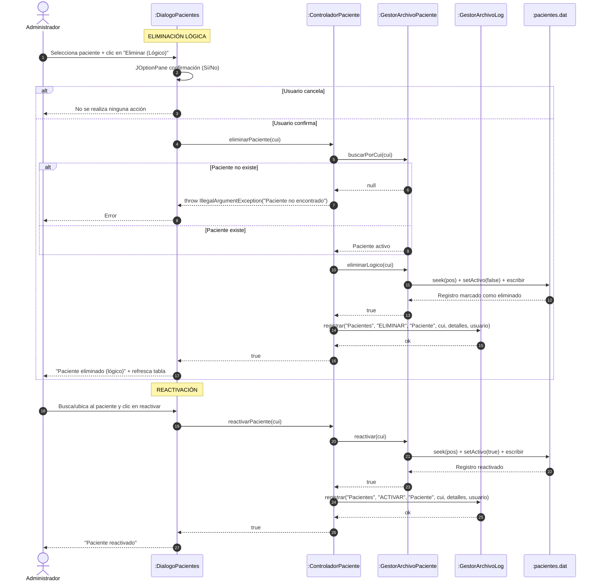
```mermaid
sequenceDiagram
    autonumber
    actor A as Administrador
    participant DP as :DialogoPacientes
    participant CP as :ControladorPaciente
    participant GPa as :GestorArchivoPaciente
    participant GL as :GestorArchivoLog
    participant F as :pacientes.dat

    Note over DP: ELIMINACIÓN LÓGICA
    A->>DP: Selecciona paciente + clic en "Eliminar (Lógico)"
    DP->>DP: JOptionPane confirmación (Sí/No)
    alt Usuario cancela
        DP-->>A: No se realiza ninguna acción
    else Usuario confirma
        DP->>CP: eliminarPaciente(cui)
        CP->>GPa: buscarPorCui(cui)
        alt Paciente no existe
            GPa-->>CP: null
            CP-->>DP: throw IllegalArgumentException("Paciente no encontrado")
            DP-->>A: Error
        else Paciente existe
            GPa-->>CP: Paciente activo
        end
        CP->>GPa: eliminarLogico(cui)
        GPa->>F: seek(pos) + setActivo(false) + escribir
        F-->>GPa: Registro marcado como eliminado
        GPa-->>CP: true
        CP->>GL: registrar("Pacientes", "ELIMINAR", "Paciente", cui, detalles, usuario)
        GL-->>CP: ok
        CP-->>DP: true
        DP-->>A: "Paciente eliminado (lógico)" + refresca tabla
    end

    Note over DP: REACTIVACIÓN
    A->>DP: Busca/ubica al paciente y clic en reactivar
    DP->>CP: reactivarPaciente(cui)
    CP->>GPa: reactivar(cui)
    GPa->>F: seek(pos) + setActivo(true) + escribir
    F-->>GPa: Registro reactivado
    GPa-->>CP: true
    CP->>GL: registrar("Pacientes", "ACTIVAR", "Paciente", cui, detalles, usuario)
    GL-->>CP: ok
    CP-->>DP: true
    DP-->>A: "Paciente reactivado"
```

> **Nota de defensa**: la eliminación es **lógica** (bandera `activo='0'`). El registro físico permanece en `pacientes.dat`, preservando las posiciones; por eso `eliminarFisico()` existe pero **no** se usa en la GUI. `existeCui()` permite detectar eliminados para impedir duplicados.

---

## Diagrama 10: Registrar un Nuevo Médico (Caso de Uso "Gestionar Médicos")

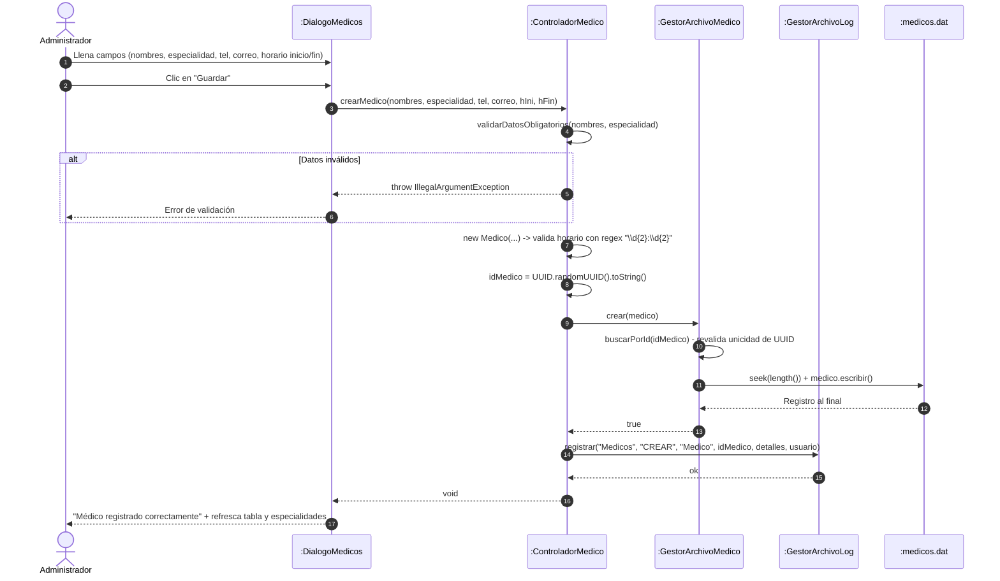
```mermaid
sequenceDiagram
    autonumber
    actor A as Administrador
    participant DM as :DialogoMedicos
    participant CM as :ControladorMedico
    participant GM as :GestorArchivoMedico
    participant GL as :GestorArchivoLog
    participant F as :medicos.dat

    A->>DM: Llena campos (nombres, especialidad, tel, correo, horario inicio/fin)
    A->>DM: Clic en "Guardar"
    DM->>CM: crearMedico(nombres, especialidad, tel, correo, hIni, hFin)

    %% Validación de obligatorios (nombres y especialidad)
    CM->>CM: validarDatosObligatorios(nombres, especialidad)
    alt Datos inválidos
        CM-->>DM: throw IllegalArgumentException
        DM-->>A: Error de validación
    end

    %% Validación de formato de horario HH:MM (en setters)
    CM->>CM: new Medico(...) -> valida horario con regex "\\d{2}:\\d{2}"

    %% Se genera el UUID automáticamente en el constructor de Medico
    CM->>CM: idMedico = UUID.randomUUID().toString()

    %% Persistencia (append al final)
    CM->>GM: crear(medico)
    GM->>GM: buscarPorId(idMedico) - revalida unicidad de UUID
    GM->>F: seek(length()) + medico.escribir()
    F-->>GM: Registro al final
    GM-->>CM: true

    %% Auditoría
    CM->>GL: registrar("Medicos", "CREAR", "Medico", idMedico, detalles, usuario)
    GL-->>CM: ok

    CM-->>DM: void
    DM-->>A: "Médico registrado correctamente" + refresca tabla y especialidades
```

---

## Diagrama 11: Modificar / Activar / Desactivar un Médico

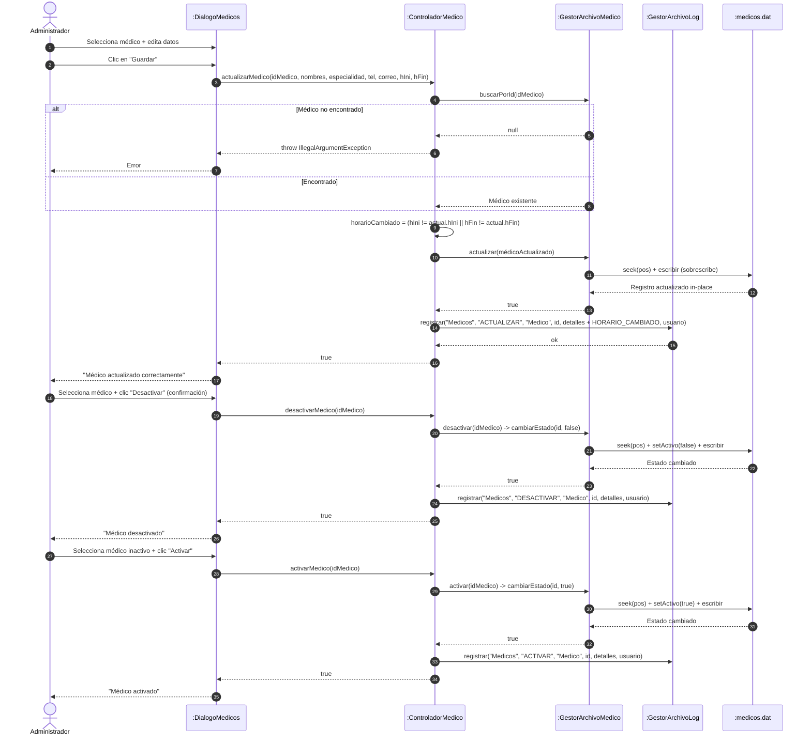
```mermaid
sequenceDiagram
    autonumber
    actor A as Administrador
    participant DM as :DialogoMedicos
    participant CM as :ControladorMedico
    participant GM as :GestorArchivoMedico
    participant GL as :GestorArchivoLog
    participant F as :medicos.dat

    %% ===== MODIFICAR =====
    A->>DM: Selecciona médico + edita datos
    A->>DM: Clic en "Guardar"
    DM->>CM: actualizarMedico(idMedico, nombres, especialidad, tel, correo, hIni, hFin)

    CM->>GM: buscarPorId(idMedico)
    alt Médico no encontrado
        GM-->>CM: null
        CM-->>DM: throw IllegalArgumentException
        DM-->>A: Error
    else Encontrado
        GM-->>CM: Médico existente
    end

    %% Detección de cambio de horario para el log
    CM->>CM: horarioCambiado = (hIni != actual.hIni || hFin != actual.hFin)
    CM->>GM: actualizar(médicoActualizado)
    GM->>F: seek(pos) + escribir (sobrescribe)
    F-->>GM: Registro actualizado in-place
    GM-->>CM: true
    CM->>GL: registrar("Medicos", "ACTUALIZAR", "Medico", id, detalles + HORARIO_CAMBIADO, usuario)
    GL-->>CM: ok
    CM-->>DM: true
    DM-->>A: "Médico actualizado correctamente"

    %% ===== DESACTIVAR (eliminación lógica) =====
    A->>DM: Selecciona médico + clic "Desactivar" (confirmación)
    DM->>CM: desactivarMedico(idMedico)
    CM->>GM: desactivar(idMedico) -> cambiarEstado(id, false)
    GM->>F: seek(pos) + setActivo(false) + escribir
    F-->>GM: Estado cambiado
    GM-->>CM: true
    CM->>GL: registrar("Medicos", "DESACTIVAR", "Medico", id, detalles, usuario)
    CM-->>DM: true
    DM-->>A: "Médico desactivado"

    %% ===== ACTIVAR =====
    A->>DM: Selecciona médico inactivo + clic "Activar"
    DM->>CM: activarMedico(idMedico)
    CM->>GM: activar(idMedico) -> cambiarEstado(id, true)
    GM->>F: seek(pos) + setActivo(true) + escribir
    F-->>GM: Estado cambiado
    GM-->>CM: true
    CM->>GL: registrar("Medicos", "ACTIVAR", "Medico", id, detalles, usuario)
    CM-->>DM: true
    DM-->>A: "Médico activado"
```

> **Nota de defensa**: activar/desactivar reutiliza `cambiarEstado(id, activo)` y se implementa como cambio de bandera sobre el registro (eliminación lógica). `activarMedico` busca primero en activos y luego en inactivos para poder reactivar.

---

## Diagrama 12: Buscar Citas mediante Filtros (Paciente / Médico / Estado / Rango)

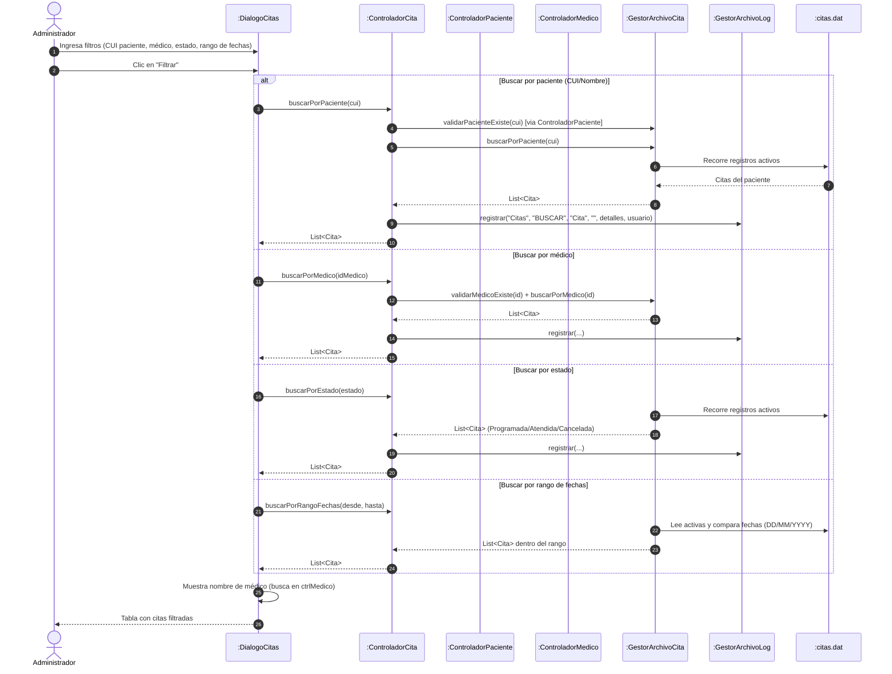
```mermaid
sequenceDiagram
    autonumber
    actor A as Administrador
    participant DC as :DialogoCitas
    participant CC as :ControladorCita
    participant CPa as :ControladorPaciente
    participant CM as :ControladorMedico
    participant GC as :GestorArchivoCita
    participant GL as :GestorArchivoLog
    participant F as :citas.dat

    A->>DC: Ingresa filtros (CUI paciente, médico, estado, rango de fechas)
    A->>DC: Clic en "Filtrar"

    alt Buscar por paciente (CUI/Nombre)
        DC->>CC: buscarPorPaciente(cui)
        CC->>GC: validarPacienteExiste(cui) [via ControladorPaciente]
        CC->>GC: buscarPorPaciente(cui)
        GC->>F: Recorre registros activos
        F-->>GC: Citas del paciente
        GC-->>CC: List<Cita>
        CC->>GL: registrar("Citas", "BUSCAR", "Cita", "", detalles, usuario)
        CC-->>DC: List<Cita>
    else Buscar por médico
        DC->>CC: buscarPorMedico(idMedico)
        CC->>GC: validarMedicoExiste(id) + buscarPorMedico(id)
        GC-->>CC: List<Cita>
        CC->>GL: registrar(...)
        CC-->>DC: List<Cita>
    else Buscar por estado
        DC->>CC: buscarPorEstado(estado)
        GC->>F: Recorre registros activos
        GC-->>CC: List<Cita> (Programada/Atendida/Cancelada)
        CC->>GL: registrar(...)
        CC-->>DC: List<Cita>
    else Buscar por rango de fechas
        DC->>CC: buscarPorRangoFechas(desde, hasta)
        GC->>F: Lee activas y compara fechas (DD/MM/YYYY)
        GC-->>CC: List<Cita> dentro del rango
        CC-->>DC: List<Cita>
    end

    DC->>DC: Muestra nombre de médico (busca en ctrlMedico)
    DC-->>A: Tabla con citas filtradas
```

---

## Diagrama 13: Actualizar Detalles de una Cita (Motivo / Observaciones)

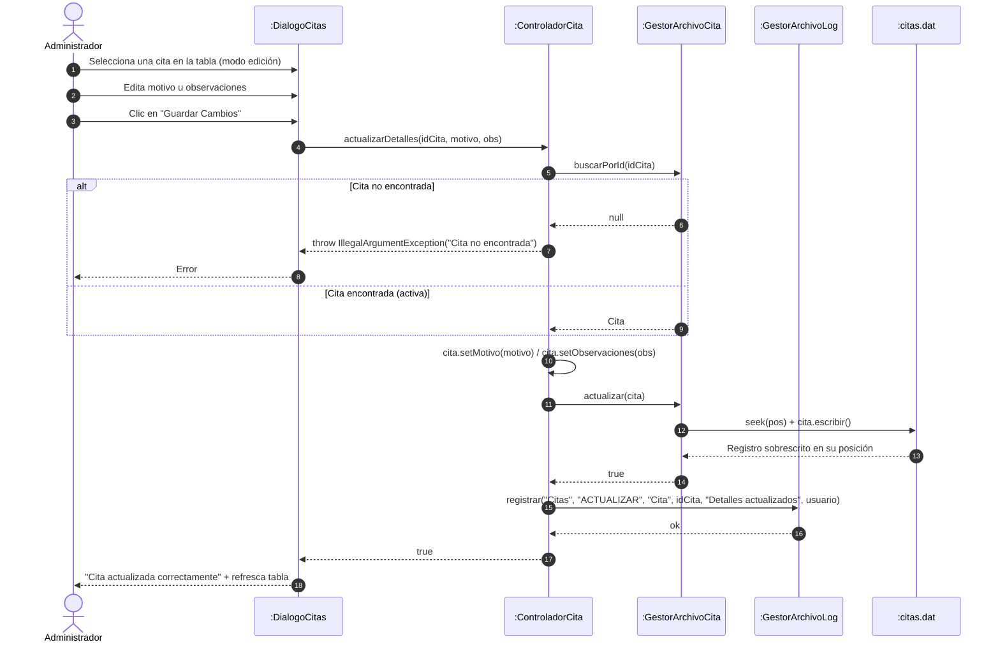
```mermaid
sequenceDiagram
    autonumber
    actor A as Administrador
    participant DC as :DialogoCitas
    participant CC as :ControladorCita
    participant GC as :GestorArchivoCita
    participant GL as :GestorArchivoLog
    participant F as :citas.dat

    A->>DC: Selecciona una cita en la tabla (modo edición)
    A->>DC: Edita motivo u observaciones
    A->>DC: Clic en "Guardar Cambios"
    DC->>CC: actualizarDetalles(idCita, motivo, obs)

    CC->>GC: buscarPorId(idCita)
    alt Cita no encontrada
        GC-->>CC: null
        CC-->>DC: throw IllegalArgumentException("Cita no encontrada")
        DC-->>A: Error
    else Cita encontrada (activa)
        GC-->>CC: Cita
    end

    %% Solo se cambian motivo/observaciones (fecha, hora y médico quedan igual)
    CC->>CC: cita.setMotivo(motivo) / cita.setObservaciones(obs)

    %% Sobrescritura en la posición del registro
    CC->>GC: actualizar(cita)
    GC->>F: seek(pos) + cita.escribir()
    F-->>GC: Registro sobrescrito en su posición
    GC-->>CC: true

    %% Auditoría
    CC->>GL: registrar("Citas", "ACTUALIZAR", "Cita", idCita, "Detalles actualizados", usuario)
    GL-->>CC: ok

    CC-->>DC: true
    DC-->>A: "Cita actualizada correctamente" + refresca tabla
```

---

## Diagrama 14: Generar Reportes Especiales (Pacientes con Más Citas / Sin Citas)

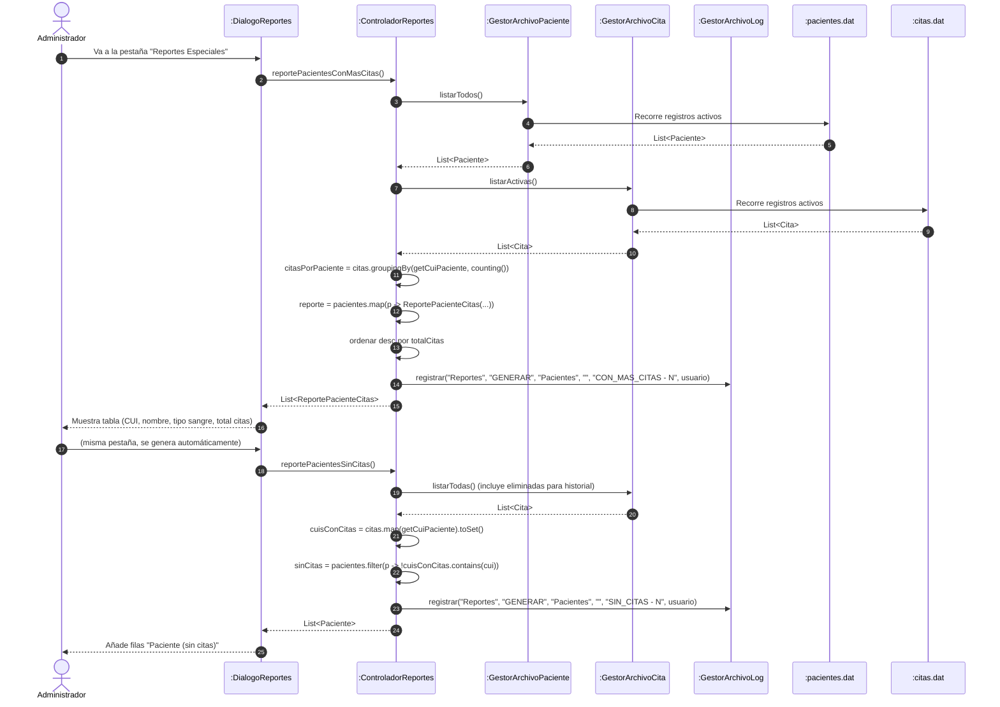
```mermaid
sequenceDiagram
    autonumber
    actor A as Administrador
    participant DR as :DialogoReportes
    participant CR as :ControladorReportes
    participant GP as :GestorArchivoPaciente
    participant GC as :GestorArchivoCita
    participant GL as :GestorArchivoLog
    participant FP as :pacientes.dat
    participant FC as :citas.dat

    A->>DR: Va a la pestaña "Reportes Especiales"
    DR->>CR: reportePacientesConMasCitas()

    %% Cargar todos los pacientes activos
    CR->>GP: listarTodos()
    GP->>FP: Recorre registros activos
    FP-->>GP: List<Paciente>
    GP-->>CR: List<Paciente>

    %% Cargar todas las citas activas
    CR->>GC: listarActivas()
    GC->>FC: Recorre registros activos
    FC-->>GC: List<Cita>
    GC-->>CR: List<Cita>

    %% Agregación con streams (groupingBy + counting)
    CR->>CR: citasPorPaciente = citas.groupingBy(getCuiPaciente, counting())
    CR->>CR: reporte = pacientes.map(p -> ReportePacienteCitas(...))
    CR->>CR: ordenar desc por totalCitas
    CR->>GL: registrar("Reportes", "GENERAR", "Pacientes", "", "CON_MAS_CITAS - N", usuario)

    CR-->>DR: List<ReportePacienteCitas>
    DR-->>A: Muestra tabla (CUI, nombre, tipo sangre, total citas)

    %% Segundo reporte: pacientes sin citas
    A->>DR: (misma pestaña, se genera automáticamente)
    DR->>CR: reportePacientesSinCitas()
    CR->>GC: listarTodas() (incluye eliminadas para historial)
    GC-->>CR: List<Cita>
    CR->>CR: cuisConCitas = citas.map(getCuiPaciente).toSet()
    CR->>CR: sinCitas = pacientes.filter(p -> !cuisConCitas.contains(cui))
    CR->>GL: registrar("Reportes", "GENERAR", "Pacientes", "", "SIN_CITAS - N", usuario)
    CR-->>DR: List<Paciente>
    DR-->>A: Añade filas "Paciente (sin citas)"
```

> **Nota de defensa**: los reportes usan la **API de streams** (`Collectors.groupingBy`, `counting`, `sorted(...reversed())`) para agregar las citas por paciente/médico/especialidad. `reportePacientesSinCitas` usa `listarTodas()` (incluye eliminadas) para que el historial sea correcto.

---

## Diagrama 15: Exportación a CSV/Texto y Cierre de la Aplicación (Logout)

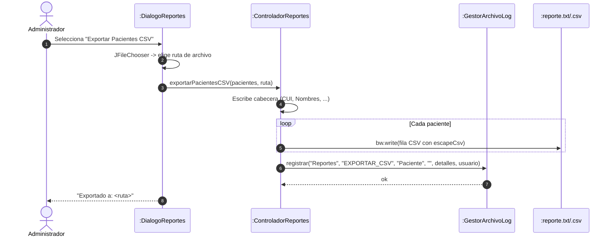
```mermaid
sequenceDiagram
    autonumber
    actor A as Administrador
    participant DR as :DialogoReportes
    participant CR as :ControladorReportes
    participant GL as :GestorArchivoLog
    participant EXT as :reporte.txt/.csv

    %% ===== EXPORTACIÓN CSV (Reportes) =====
    A->>DR: Selecciona "Exportar Pacientes CSV"
    DR->>DR: JFileChooser -> elige ruta de archivo
    DR->>CR: exportarPacientesCSV(pacientes, ruta)
    CR->>CR: Escribe cabecera (CUI, Nombres, ...)
    loop Cada paciente
        CR->>EXT: bw.write(fila CSV con escapeCsv)
    end
    CR->>GL: registrar("Reportes", "EXPORTAR_CSV", "Paciente", "", detalles, usuario)
    GL-->>CR: ok
    DR-->>A: "Exportado a: <ruta>"
```

> **Nota de defensa**: el mismo patrón se aplica a la exportación de Médicos, Citas y Logs (CSV) y a la exportación a **texto plano tabular** (`exportarTextoPlano`) con su cabecera y separador `-+-`. Cada exportación queda registrada en el log con operación `EXPORTAR_CSV` / `EXPORTAR_TXT`.

---

## Diagrama 15b: Cerrar Sesión y Cerrar la Aplicación (Logout)

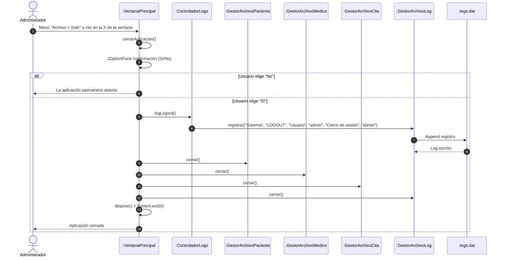
```mermaid
sequenceDiagram
    autonumber
    actor A as Administrador
    participant VP as :VentanaPrincipal
    participant CL as :ControladorLogs
    participant GPa as :GestorArchivoPaciente
    participant GM as :GestorArchivoMedico
    participant GC as :GestorArchivoCita
    participant GL as :GestorArchivoLog
    participant F as :logs.dat

    A->>VP: Menú "Archivo > Salir" o clic en la X de la ventana
    VP->>VP: cerrarAplicacion()
    VP->>VP: JOptionPane confirmación (Sí/No)
    alt Usuario elige "No"
        VP-->>A: La aplicación permanece abierta
    else Usuario elige "Sí"
        %% Registrar cierre de sesión
        VP->>CL: logLogout()
        CL->>GL: registrar("Sistema", "LOGOUT", "Usuario", "admin", "Cierre de sesión", "admin")
        GL->>F: Append registro
        F-->>GL: Log escrito

        %% Cerrar cada gestor (liberar RandomAccessFile)
        VP->>GPa: cerrar()
        VP->>GM: cerrar()
        VP->>GC: cerrar()
        VP->>GL: cerrar()

        VP->>VP: dispose() + System.exit(0)
        VP-->>A: Aplicación cerrada
    end
```

---

## Resumen de Flujos Cubiertos

| # | Diagrama | Entidades participantes | Conceptos clave que demuestran |
|---|----------|--------------------------|--------------------------------|
| 1 | Programar Cita | Cita, Paciente, Médico, Log | Validación paciente/médico activo, anti-solapamiento (30 min), persistencia append, auditoría |
| 2 | Registrar Paciente | Paciente, Log | Unicidad de CUI (clave), validaciones de formato, persistencia |
| 3 | Buscar Citas por Rango | Cita, Log, Reportes | Recorrido secuencial, comparación de fechas, exportación CSV |
| 4 | Cancelar Cita | Cita, Log | Cambio de estado, sobrescritura en posición (RandomAccessFile) |
| 5 | Ver Logs | Log | Lectura inversa del archivo, filtros (módulo, fecha, usuario) |
| 6 | Inicialización | Todos | Inyección de dependencias, apertura de archivos |
| 7 | Reprogramar Cita | Cita, Médico, Log | Revalidación de solapamiento excluyendo cita actual |
| 8 | Modificar Paciente | Paciente, Log | Sobrescritura in-place, clave primaria inmutable |
| 9 | Eliminar/Reactivar Paciente | Paciente, Log | Eliminación lógica (bandera), reactivación |
| 10 | Registrar Médico | Médico, Log | Generación de UUID, validación de horario |
| 11 | Modificar/Activar/Desactivar Médico | Médico, Log | Cambio de estado, detección de cambio de horario |
| 12 | Buscar Citas con Filtros | Cita, Log | Búsqueda por paciente/médico/estado/rango |
| 13 | Actualizar Detalles de Cita | Cita, Log | Actualización parcial de motivo/observaciones |
| 14 | Reportes Especiales | Paciente, Cita, Log | Agregación con streams (groupingBy/counting) |
| 15 | Exportar a CSV/Texto | Reportes, Log | Escritura de archivo externo + log EXPORTAR |
| 15b | Cerrar Sesión (Logout) | Log, Gestores | logLogout, cierre de gestores, System.exit |

### Notas de implementación relevantes para la defensa
- **Duración fija de 30 min**: `seSolapan(hora1, hora2)` calcula `fin = inicio + 30` y verifica `inicio1 < fin2 && inicio2 < fin1`.
- **Eliminación lógica**: los flags `activo`/`activa` preservan las posiciones del archivo; se puede reactivar.
- **Lectura inversa de logs**: `listarTodos()` itera de `total-1` a `0` para mostrar los más recientes primero.
- **Append para crear**: `archivo.seek(archivo.length())` agrega registros al final sin compactación.
- **Sobrescritura para actualizar**: `archivo.seek(pos)` + `escribir()` reemplaza el registro en su sitio (permite actualización in-place).
